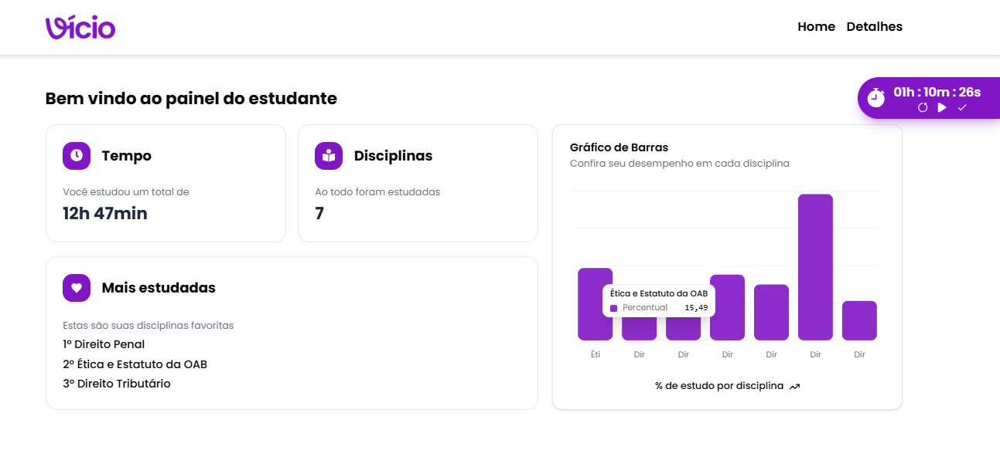

## 📘 Vde Academy - Plataforma de Estudos

Uma aplicação para monitorar suas sessões de estudo de forma eficiente, com estatísticas e histórico detalhado.

## 🚀 Instalação e Execução

### Clone o repositório
git clone https://github.com/Rafael-Arruda/vde-academy.git 

### Acesse a pasta do projeto
cd vde-academy 

### Instale as dependências
npm install  

### Execute a aplicação
npm run dev 

A aplicação estará disponível em http://localhost:3000/.

## 📌 Funcionalidades

### 🏠 Página Home
- Dois seletores: disciplina e tema.
- Os temas são filtrados conforme a disciplina escolhida.
- Dados fictícios (mockados) em /src/data.js.
- O botão "Iniciar" só é habilitado quando ambos os campos são preenchidos.
- Um cronômetro aparece no canto superior direito durante o estudo.
- Ao finalizar, os dados são refletidos globalmente através do contexto da aplicação.
- Exibição de cards com as últimas disciplinas e temas estudados.

### 📊 Página Detalhes
- Exibe estatísticas visuais (gráfico e cards) sobre o tempo de estudo.
- Dados atualizados automaticamente ao finalizar o cronômetro.

## 🛠️ Tecnologias Utilizadas
- Next.js – Framework para React.
- Tailwind CSS – Estilização rápida e eficiente.
- TypeScript – Tipagem estática para maior segurança no código.
- React Toastify – Alertas e notificações.
- React Icons – Ícones modernos e práticos.
- Shadcn UI – Componentes minimalistas e customizáveis.
